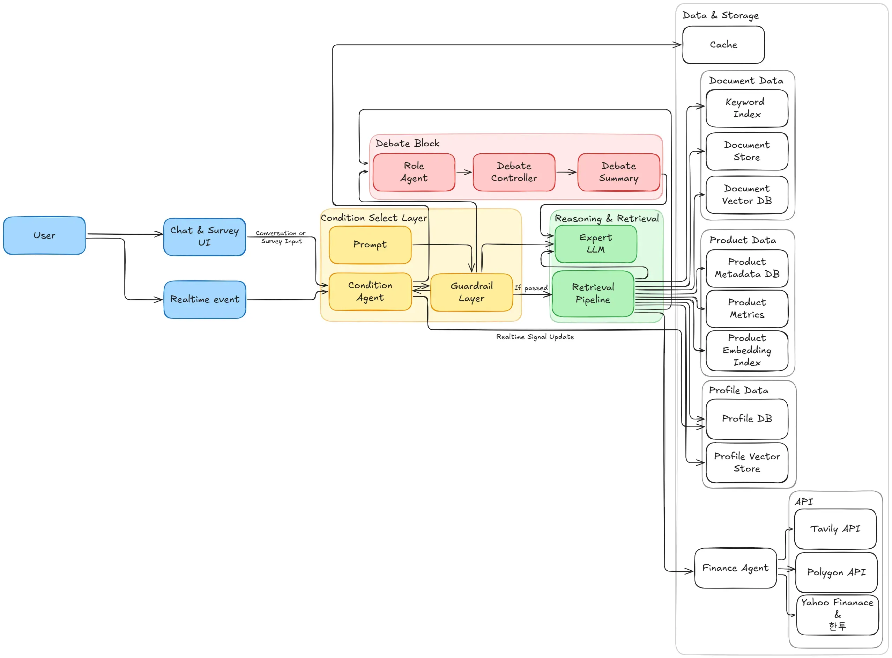

# FinAgent Investment Agent

<div align="center">
  <a href="README.md">🇺🇸 English</a> | <a href="README_KR.md">🇰🇷 한국어</a>
</div>

<br>

**FinAgent** is a sophisticated Multi-Agent AI system designed to provide personalized investment advice. By orchestrating specialized agents—from profile analysis to fierce debates between opposing viewpoints—it delivers comprehensive, data-driven financial reports tailored to the user's specific risk tolerance and goals.

## System Architecture

The system follows a graph-based workflow powered by LangGraph, ensuring modularity and context retention throughout the user interaction.



### Workflow Overview

1.  **Input Guardrail**: Every user input is first checked for safety and domain relevance. Non-financial queries are filtered out immediately.
2.  **Context-Aware Routing**: The **`Condition Node`** analyzes the user's intent and conversation history to decide the next step:
    * *New User / Profile Update* → **`User Chat`** (Onboarding)
    * *Simple Data Query* → **`Retriever`** (Search)
    * *Complex Investment Advice* → **`Debate`** (Analysis)
    * *Report Generation* → **`Finance`** (Synthesis)
3.  **Multi-Agent Collaboration**:
    * **User Chat**: Conducts a natural interview to fill missing KYC data (Risk level, Income, etc.) and syncs with Supabase.
    * **Debate**: **Bull, Bear, and Balanced experts** engage in a multi-round debate using real-time data (Yahoo Finance, Tavily) to analyze risks and opportunities.
    * **Retriever**: Fetches specific product data via SQL or general knowledge via RAG.
4.  **Final Output**: The **`Finance Node`** synthesizes all gathered insights and debate conclusions into a structured Markdown report.

### Key Modules:

1. Guardrail: Ensures safety and domain relevance, filtering out non-financial queries.
2. Condition: The intelligent router that analyzes user intent and context to direct the flow (e.g., to Debate, Retriever, or Profile setup).
3. User Chat: Conducts a natural interview to collect and manage user profiles (KYC) and synchronizes data with the database.
4. Retriever: Handles data fetching via SQL (for products), RAG (for regulations), and APIs (for market prices).
5. Debate: Simulates a fierce debate between Bull (Aggressive), Bear (Conservative), and Balanced experts, concluded by a Judge (CIO).

## Project Structure
```
FinAgent_Investment_Agent/
├── assets/                  # Static assets (images, diagrams)
├── condtition/              # Router & Safety Layer
│   ├── condition.py         # Context-aware routing logic
│   └── guardrail.py         # Input validation & safety checks
├── debate/                  # Debate Engine
│   ├── node.py              # 5-Round Debate Logic (Bull vs Bear vs Judge)
│   └── tools.py             # Tools for debate (News, Market Data)
├── finance/                 # Reporting Engine
│   ├── node.py              # Final Report Generation
│   └── tools.py             # SQL-based Product Recommendation Tools
├── retriever/               # Information Retrieval
│   ├── node.py              # ReAct Agent for Search
│   └── tools.py             # Hybrid Search (SQL + Vector + Web)
├── user_chat/               # User Onboarding
│   ├── models.py            # Pydantic Data Models for Profile
│   └── node.py              # Interview & DB Sync Logic
├── utils/                   # Core Utilities
│   ├── const.py             # Constants & Prompts
│   ├── db.py                # Supabase Connection
│   ├── embedding.py         # BGE-M3 Embedding Loader
│   ├── llm.py               # OpenRouter/HTTPX Client
│   └── state.py             # Shared Agent State (Memory)
├── .env                     # API Keys and Config
├── .gitignore
├── api.py                   # FastAPI REST API Server
├── main.py                  # Application Entry Point (Graph Compiler)
└── README.md                # Project Documentation
```

## 1. Installation

Clone the repository and install the required dependencies

```bash
# Clone repository
git clone https://github.com/your-repo/FinAgent_Investment_Agent.git
cd FinAgent

# Install dependencies
pip install -r requirements.txt
```

## 2. Configuration

Create a ```.env``` file in the root directory and add your API keys:

```
OPENROUTER_API_KEY="your-api-key"

SUPABASE_URL="your-supbase-url"
SUPABASE_SERVICE_KEY="your-api-key"

TAVILY_API_KEY="your-api-key"
```

## 3. Usage

### Option A: Interactive CLI Mode

Run the main script to start the interactive CLI session.
```bash
python main.py
```

### Option B: REST API Server

Start the FastAPI server for programmatic access:
```bash
python api.py
```

The server will start on `http://localhost:8000`

#### API Endpoints

**POST /chat** - Send messages and receive AI responses
```bash
curl -X POST http://localhost:8000/chat \
  -H "Content-Type: application/json" \
  -d '{
    "user_id": "test_user",
    "message": "Should I invest in Nvidia?",
    "session_id": "optional-session-id"
  }'
```

Response:
```json
{
  "session_id": "abc123",
  "user_id": "test_user",
  "message": "Should I invest in Nvidia?",
  "response": "Let me analyze Nvidia for you...",
  "node_executed": "debate",
  "debate_history": [...],
  "timestamp": "2024-01-03T12:00:00"
}
```

**GET /profile/{user_id}** - Retrieve user profile
```bash
curl http://localhost:8000/profile/test_user
```

**POST /profile/{user_id}** - Create/Update user profile
```bash
curl -X POST http://localhost:8000/profile/test_user \
  -H "Content-Type: application/json" \
  -d '{
    "name_display": "John Doe",
    "age_range": "30대",
    "risk_tolerance_level": "aggressive",
    "goal_type": "long_term"
  }'
```

**GET /health** - Health check endpoint
```bash
curl http://localhost:8000/health
```

## 4. Example
Scenario: A user asks about investing in Nvidia.

```text
User: Should I buy Nvidia right now?

Guardrail: [finance] -> Allowed: True
Routing to [debate] (Reason: User is asking for investment advice.)

[Debate Arena] Topic: Should I buy Nvidia right now? (5 Rounds)

--- Round 1: Opening Statement ---
Turn: Conservative Expert
Arg: Nvidia's valuation is too high (PER > 70). Regulatory risks in China are concerning...

Turn: Aggressive Expert
Arg: AI demand is just starting. Nvidia has a monopoly on H100 chips...

... (Rounds 2, 3, 4...) ...

Judge's Verdict:
   "While growth potential is undeniable, short-term volatility is expected. 
    I recommend a split-buying strategy."

AI Suggestion: "Shall we analyze the exchange rate risk before writing the report?"

User: Yes, please check that.

... (Additional Debate on Exchange Rates) ...

[Finance Node] Generating Final Report...
Report Saved to DB.

Agent (finance):
# 📋 Investment Advisory Report: Nvidia Analysis
## 1. Market Analysis...
## 2. Investment Strategy...
## 3. Recommended Portfolio (Product: TIGER US Tech Top 10)...
```

## Key Components
**Hybrid Market Data Tools (```utils/tools.py```)**  
Our agent uses a hybrid approach to fetch real-time stock data:
- **Korean Stocks**: Uses FinanceDataReader (Naver Finance based).
- **Global Stocks/Indices**: Uses Yahoo Finance (with auto-ticker mapping).

**Context-Aware Router (```condition/condition.py```)**  
The router doesn't just look at the last message. It analyzes the entire conversation history to determine if the user is answering a profile question, agreeing to a suggestion, or asking a new question, preventing infinite loops.

**Database Synchronization (```user_chat/node.py```)**
- **Load**: Fetches existing user profiles on startup.
- **Upsert**: Automatically updates the profile in Supabase whenever new information is extracted during the chat.
- **Strict Schema**: Enforces strict data types (e.g., risk_tolerance_level Enum) to ensure data integrity.

## Outputs
- **Conversation History**: Stored in-memory using MemorySaver for context retention.
- **User Profile**: Persisted in the user_profile table in Supabase.
- **Advisory Report**: Final reports are saved in the advisory_reports table and presented to the user in Markdown format.
